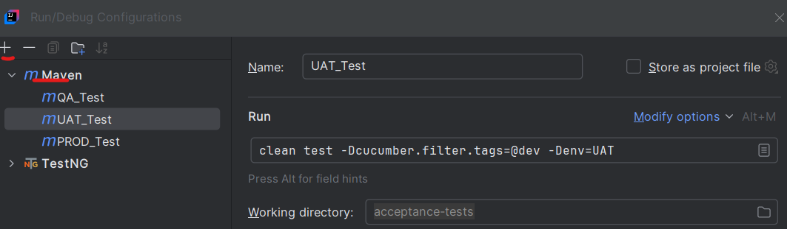
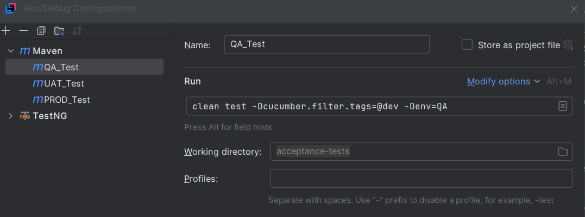
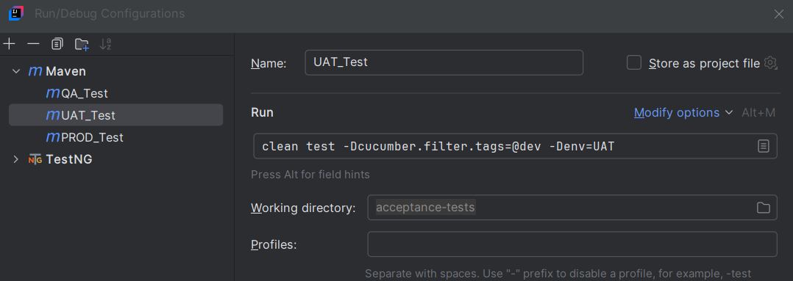

            
BDD Automation Test Framework for API Testing                                                                        BDD Automation Test Framework for API Testing

1. Installation and Setup
   
   Prerequisites:

         Java Development Kit (JDK) installed.
         Maven or Gradle installed.
         IDE (e.g., IntelliJ IDEA, Eclipse) set up with Cucumber plugins.
      
   Steps to set up the BDD Automation Test Framework:

         1. Create a back up directory in the local machine
         2. Open command line and go to the directory
         3. To Clone the repository: https://github.com/UpScript/DataAPI_AcceptanceTest
            
            git clone [<repository-url>](https://github.com/UpScript/DataAPI_AcceptanceTest)
            
            mvn clean install
         4. Make sure there is no build error.

2. Framework Configuration and Running the tests
      

      Running Tests:

       1. Click on the Run / Debug dropdown button
       2. Edit configuration button  
       3. Click + button to add maven configuration
            
       4. Configuring the acceptance test locally for different environment.
            QA:
            
            
            UAT:
            
       5. Click Play button after selecting the created environment.

3. Test Reporting and Results

      The framework generates detailed execution reports. Reports can be accessed in:
      target/cucumber-reports for HTML reports.
      
         acceptance-tests\target\cucumber\cucumber.html

4. Future Enhancements

            1. UI integration
            2. JIRA integration